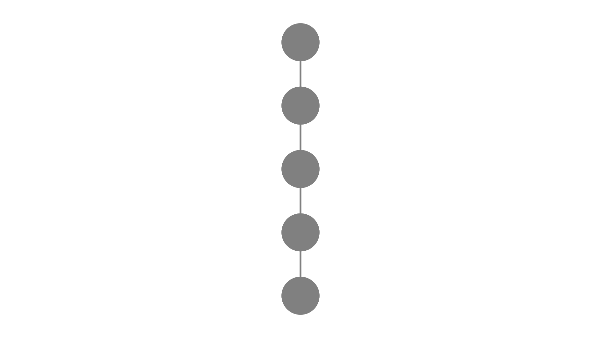
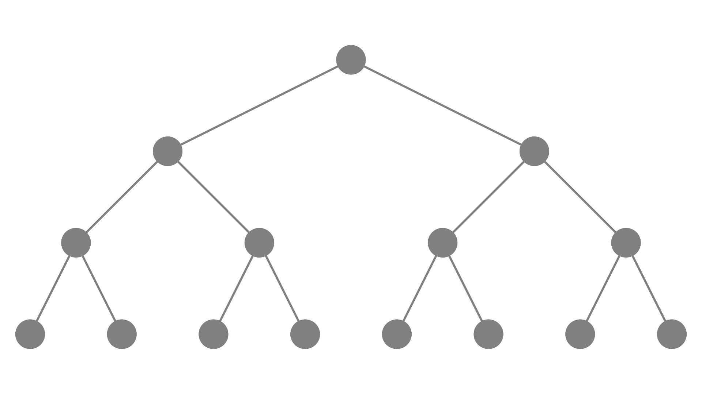

To compute search time complexity of a binary search tree (BST) we need to define a few things first.

Every node on the tree has a path, which are the nodes we have visited before we got into that certain node. The path length is defined as the amount of nodes previous visited. For example, the root node has a path length of zero since no node is previous visited. The nodes immediately after the root have a path length of 1 and so on.

Besides the path, we can define a level and height for every node on the tree.

A level is defined as being the path length plus one. For example, the root node has level 1 since its path length is zero. The nodes immediately after the root have level 2 since their path length is 1 and so on.
Height, in turn, is defined as being the highest level on the tree.

To calculate the average cost of finding a node in the BST we should sum all path lengths of all nodes and divide it by the number of nodes. This is given by the following formulas:

$$
IPL = \sum_{i=1}^{h}f(i)\cdot(i-1)
$$

$$
APL = \frac{IPL}{n}
$$

where $i$ represents the level that will iterate from the root to the height ($h$). The function $f(i)$ is what will calculate the number of nodes in that level and $(i-1)$ is the path length of current level. IPL is the sum of length of all nodes (IPL stands for internal path length) and APL is the average (APL stands for average path length).

When we are talking about an incomplete binary tree (when the number of leaves in the tree is not a power of 2), the worst shape it can have is exactly the same as a linked list. On this scenario, the time complexity to find a certain node is $\mathbb{O}(n)$.

To demonstrate this, let's see how this kind of tree looks like.

    

It is noticeable that each level has only one node, so, our $f(i)$ will always be:

$$
f(i) = 1
$$

Another thing that we can notice is that the heigth of the tree is equal to the number of nodes, so:

$$
h = n
$$

where $n$ is the number of nodes.

With all that information in hands we can calculate the average.

$$
IPL = \sum_{i=1}^{n}1(i-1) = \frac{(0+n-1)n}{2} = \frac{(n-1)n}{2}
$$

$$
APL = \frac{IPL}{n} = \frac{\frac{(n-1)n}{2}}{n} = \frac{(n-1)n}{2n} = \frac{n-1}{2}
$$

$$
APL = \frac{n-1}{2}
$$

which is $\mathbb{O}(n)$ as we wanted to prove.

(If you want to see a more mathematical approach of how big $\mathbb{O}$ notation works and you speak portuguese, checkout [this video](https://www.youtube.com/watch?v=miLF-hDeNzU) made by some guy that turns out to have the same as me)

The best case of a BST is a complete tree. This means that every node, except for the leaves, has two children. Here is a representation of a generic complete BST:

    

To compute the amount of nodes at a certain level in a complete BST, we need to have in mind that for each level the amount of nodes is the same as the amount of the previous level multiplied by two. So the first level has $1$ node, the second has $1\cdot2$, the third level $1\cdot2\cdot2=1\cdot2^2$, the fourth $1\cdot2^2\cdot2 = 2^3$ and so on. This can be generalized as $f(i) = 2^{i-1}$ being $i$ the current level. Therefore the average cost of searching in a complete BST is calculate as follows:

$$
IPL = \sum_{i=1}^{h}(2^{i-1})(i - 1)
$$

We can distribute the multiplication:

$$
IPL = \sum_{i=1}^{h}(2^{i-1}\cdot i - 2^{i-1})
$$

and separate the summatory.

$$
IPL = \sum_{i = 1}^{h}2^{i-1}\cdot i - \sum_{i = 1}^{h}2^{i-1}
$$

Since $\sum_{i = 1}^{h}2^{i-1}$ is a geometric progression, we have:

$$
IPL = \sum_{i = 1}^{h}(2^{i-1}\cdot i) - (2^h-1) = 
$$

$$
IPL = \sum_{i=1}^{n}(2^{i-1}\cdot i) - 2^h + 1
$$

Multiplying both sides by two would result in

$$
2\cdot IPL = 2\cdot\sum_{i=1}^{h}(2^{i-1}\cdot i) - 2^{h+1} + 2
$$

$$
2\cdot IPL = \sum_{i=1}^{h}(2^i\cdot i)-2^{h+1}+2
$$

we rearrange the indexes of the summatory in one unit forward

$$
2\cdot IPL = \sum_{i=2}^{h+1}(2^{i-1}\cdot [i-1]) - 2^{h+1} + 2
$$

then, we can take out the last term of the summatory, $2^{h}\cdot h$
which leaves us with

$$
2\cdot IPL = \sum_{i=2}^h(2^{i-1}\cdot [i-1]) + 2^h\cdot h -2^{h+1}+2
$$

factoring the $2^h$ terms

$$
2\cdot IPL=\sum_{i=2}^{h}(2^{i-1}\cdot [i-1]) + 2^h(h - 2) + 2
$$

notice that 

$$
\sum_{i=2}^{h}(2^{i-1}\cdot [i-1]) = \sum_{i=1}^{h}(2^{i-1}\cdot [i-1])
$$

which is exactly the same as $IPL$. Therefore we can substitute:

$$
2\cdot IPL = IPL + 2^h(h-2) + 2
$$

subtracting $IPL$ from both sides:

$$
IPL = 2^h(h-2) +2
$$

Therefore the average cost is given by:

$$
APL= \frac{2^h(h-2) + 2}{n}
$$

where $n$ is the number of nodes.